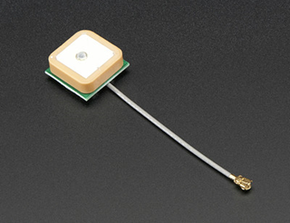

# Lesson 3: Knowing Where You Are

### Prerequisites:
- To complete this lesson, you need to be able to connect your microcontroller to your computer and upload a program to it using the IDE. If you are not able to do that, please complete [Lesson 1](../lesson-1/README.md) before continuing.
- You should have a good understanding of how to write code in the declaration, setup, and loop sections of a program. It is recommended to complete [Lesson 2](../lesson-2/README.md).

### Objectives:
Students will: 
- Learn the basic principles of the Global Positioning System  
- Learn how a GPS module communicates with a microcontroller
- Write a program to record latitude, longitude and other parameters from a GPS module.

### Materials:
- [Heltec Wireless Tracker](https://heltec.org/project/wireless-tracker/)\
  
- [External GPS Antenna](https://en.wikipedia.org/wiki/Antenna_(radio)) (optional)\
  
  
## Activity

### Understanding the Tech
You have probably used GPS on a phone or in your car many times wihtout stopping to think about the billions of dollars of technology and Einstein-level science that helps you find where you are in the world. The Global Positioning System is almost as easy to use for programmers as it is for regular users, but take a few minutes to understand and appreciate this complex system before beginning to write code for it. This article is a good introduction:
[How Stuff Works: GPS](https://electronics.howstuffworks.com/gadgets/travel/gps.htm)

After reading the article, discuss wirh your group and mentor. Can you explan the importance of these concepts in GPS?
- Triangulation
- Travel time
- Synchronized clocks

### Using a GPS Module
The Heltec Wirelss Tracker comes with a built-in GPS module and antenna. The antenna is the white square ont the front next to the display. It is larger and more visible than the module itself, which is under a metal shield on the back of the baord. 

1. The GPS module communicates with the main microcontroller using a *UART serial* connection. This type of connection sends pulses that represent letters (similar to Morse code) over two wires. One wire sends pulses *to* the microcontroller and one wire receives pulses *from* the microcontroller.\
Add the following lines at the top of a new program:
    ```
    #include "Arduino.h"
    #include "HT_TinyGPS++.h"
    #define GPS_ON 3                // the "power" pin for the GPS unit
    #define GPS_TX 33               // the GPS transmit pin
    #define GPS_RX 34               // the GPS receive pin
    #define GPS_BAUD 115200         // the pulse speed in bits per second

    TinyGPSPlus gps;                // create a GPS object to refer to in our code

    void setup(){
      pinMode(GPS_ON,OUTPUT);     // configure power pin
	    digitalWrite(GPS_ON,HIGH);  // turn on GPS module
	    Serial1.begin(GPS_BAUD,SERIAL_8N1,GPS_TX,GPS_RX);  // configure serial connection to GPS  
      delay(1000);                // pause for initialization

	    Serial.begin(115200);  
      Serial.println("GPS test beginning...");  
    }
    ```
    Read the comments to learn what these lines do. You should see that we're declaring and setting up the pine on the board that we will use for communication. Also notice that there are *two* serial connections being set up. One goes to the GPS module. What is the second one for?

2. Add a loop() section to your code:
    ```
    void loop(){
      while(Serial1.available()){
        gps.encode(Serial1.read());  // process one character at a time
      }
      // add code to output gps data here
      delay(5000);                   // pause 5s between readings  
    }
    ```
    This small section of code is key to the whole operation. The while loop repeats as long as there is data to read on the serial receive pin. The gps module *encodes* (or processes) each byte that is read. Once all available data has been resd, we can add code that will print out the gps data we are interested in.

3.  Add some code to output the GPS data. Replace the line ``` // add code to output gps data here``` with one or more of the following lines:
    - ```Serial.printf("Tracking %d satellites\n",gps.satellites.value());```
    - ```Serial.printf("Time: %02d:%02d:%02d\n",gps.time.hour(),gps.time.minute(),gps.time.second());```
    - ```Serial.printf("Latitude %f deg\n",gps.location.lat());```
    - ```Serial.printf("Longtitude %f deg\n",gps.location.lng());```
    - ```Serial.printf("Altitude %f ft\n",gps.altitude.feet());```
    - ```Serial.println();``` (adds a blank line to the output)

4. Test your GPS module: upload the code, open the serial monitor - and be prepared to be patient! As you learned earlier, your GPS module's clock needs to be set very precisely to work. It also helps for the GPS module to know roughly where in the world it is located. If this is the first time that the module has run in a while, it will need to calibarate before reporting any valaid data. This can sometimes take 30 minutes or more. You can gen an idea of how well the calibation is progressing by watching the accuracy of the time.

5. There are other readings that the gps can report. Can you find out what some are? Try slowly typing ```gps.``` and then pausing after the dot. The Arduino IDE has an autocomplete feature that will give options for what to type next. Most gps data readings are in the format ```gps.________._________()```


*Not sure if your GPS is working correctly? The [solution code linked on Github](../lesson-3/Lesson_3_solution.ino) has some extra code that prints out the raw characters being sent from the GPS module. This is informative to see and can be helpful in troubleshooting.*