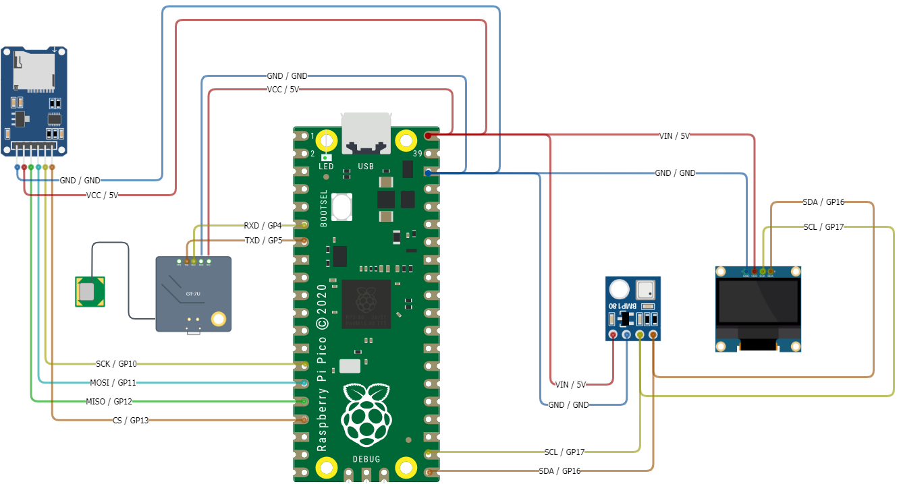

# Lesson 8: Launch

### Pre-requisites
* Complete previous sensor lessons
    * [Lesson 3: Temperature, Pressure, and Altitude](../lesson-3/README.md)
    * [Lesson 4: GPS Coordinates](../lesson-4/README.md)
    * [Lesson 5: Writing Data to SD Card Module](../lesson-5/README.md)
    * [Lesson 6: Bringing It All Together](../lesson-6/README.md)
    * [Lesson 7: Using the OLED Module](../lesson-7/README.md)
* [Thonny Python IDE](https://thonny.org/) installed on your computer
* All necessary hardware components

### Objectives
* Use all previous lessons to collect data from different modules and write to SD Card.
* Perform diagnostics on individual modules and display diagnostics to OLED module.

### Results
* A field-ready prototype of all modules capable of accurately and reliably collecting data.

  

## Steps

### Wire All the Modules into the Breadboard

**IMPORTANT** Before wiring your Pico, UNPLUG IT FROM YOUR COMPUTER. If plugged in while wiring, you risk damaging the Pico or SDCard reader.

BB = Bread Board
Module/Controller Pin | Description | BB/Pi Pico Pins
----------- | ----------- | ------------
|**SD Card Module**||
VCC         | (Voltage Common Collector): Provides power to the HW-125.  | BB Power (+)
GND         | Ground | BB Ground (-)
SCK         | (Serial Clock): Accepts clock pulses from the Pico to synchronize data transmission | GP10 (14)
MOSI        | (Master Out Slave In): SPI input to microSD card module | GP11 (15)
MISO        | (Master In Slave Out): SPI output from the microSD card module | GP12 (16)
CS          | (Chip Select): Control pin used to select one (or set) of devices on the SPI bus | GP13 (17) 
|**GPS Sensor**||
VCC          | (Voltage In): Provides power.  | BB Power (+)
GND          | Ground | BB Ground (-)
PPS          | (Pulse Per Second): Assists with synchronization | N/A
TXD          | (Transmit): Transmission pin used for serial communication | UART1 RX / GP5 (7)
RXD          | (Receive): Receiver pin used for serial communication | UART1 TX / GP4 (6)
|**Pressure Temperature Sensor**||
VIN          | (Voltage In): Provides power to the BMP-180.  | BB Power (+)
GND          | Ground | BB Ground (-)
SCL          | (Serial Clock): Accepts clock pulses from the Pico to synchronize data transmission | GP17 (22)
SDA          | (Serial Data): Used for data exchange | GP16 (21)
|**SSD1306 OLED Display Module**||
GND          | (Voltage Common Collector): Provides power to the module. Connect to the 5V pin on Pico | GND (38)
VCC          | (Ground): Connect to the ground pin on Pico | 5V (40)
SCL          | (Serial Clock): Accepts clock pulses from the Pico to synchronize data transmission | GP10 (17)
SDA          | (Serial Data): Used for data exchange | GP16 (16)
|**Raspberry Pico**||
5V (40)      | (Voltage In): Provides power.  | BB Power (+)
GND (38)     | Ground | BB Ground (-)

### Main program

The steps in this section will use the previous hardware and driver sections to allow writing/reading to/from a CSV file, reading GPS data, and pressure/temperature data. This code also incorporates better exception handling and performs a diagnostic on startup, displaying the diagnostic to the OLED display module. The code example for this lesson is located in [Lesson 8: /src/main.py](https://github.com/StratoLab/telemetry/blob/main/raspberry-pi-pico/python/lesson-8/src/main.py).